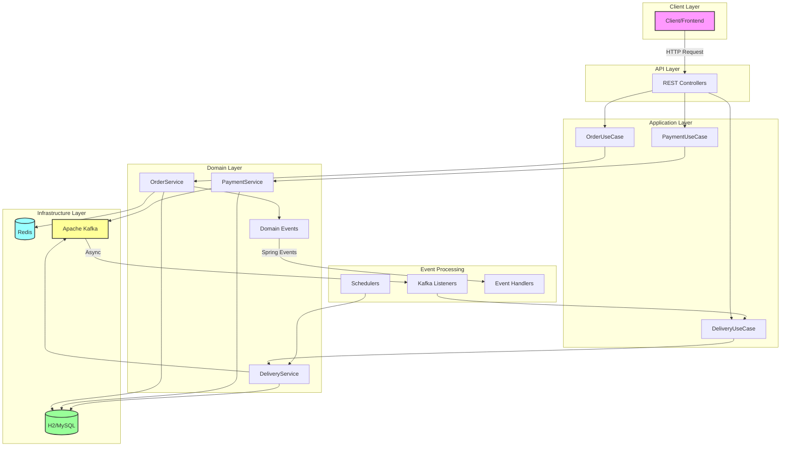
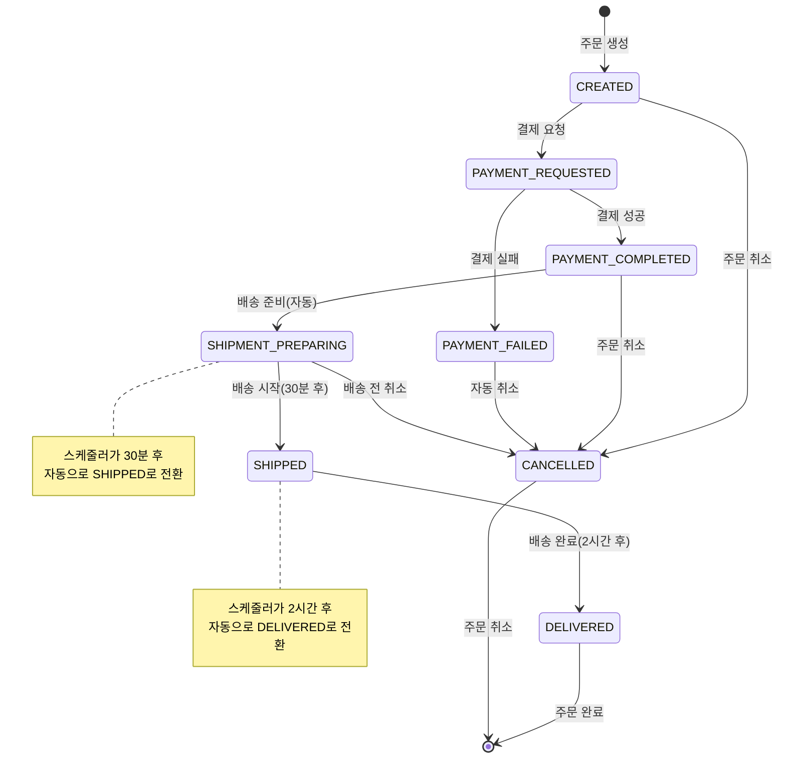
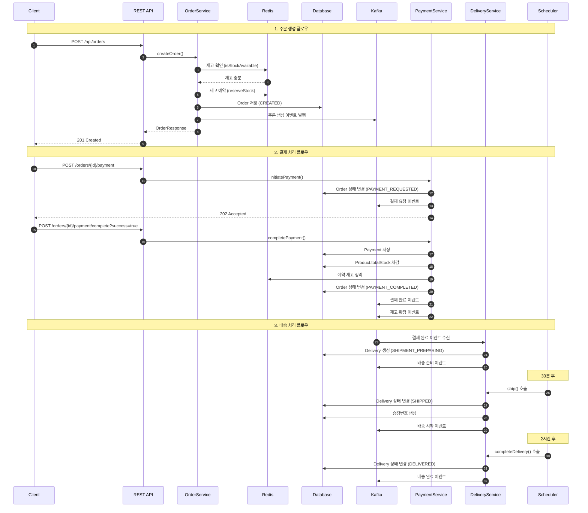
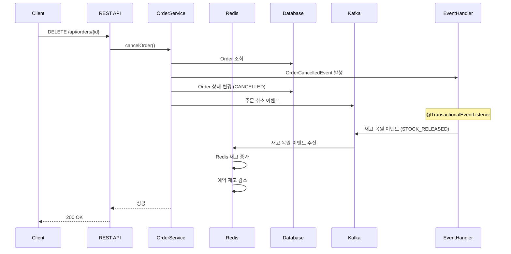

# 🛍️ Mini E-Commerce Order System

[](https://spring.io/projects/spring-boot)
[](https://www.oracle.com/java/)
[](https://redis.io/)
[](https://kafka.apache.org/)
[](LICENSE)

Spring Boot + DDD + Hexagonal Architecture 기반의 이커머스 주문 시스템입니다.

## 📋 목차
- [개요](#-개요)
- [기술 스택](#-기술-스택)
- [시스템 아키텍처](#-시스템-아키텍처)
- [주요 기능](#-주요-기능)
- [프로젝트 구조](#-프로젝트-구조)
- [시작하기](#-시작하기)
- [API 명세](#-api-명세)
- [주문 처리 플로우](#-주문-처리-플로우)
- [재고 관리 시스템](#-재고-관리-시스템)
- [이벤트 시스템](#-이벤트-시스템)
- [테스트 가이드](#-테스트-가이드)
- [배포](#-배포)
- [모니터링](#-모니터링)
- [성능 고려사항](#-성능-고려사항)
- [문제 해결](#-문제-해결)

## 🎯 개요

이 프로젝트는 실무에서 사용 가능한 수준의 이커머스 주문 시스템을 구현한 것입니다. DDD(Domain-Driven Design)와 헥사고날 아키텍처(Hexagonal Architecture)를 적용하여 확장 가능하고 유지보수가 용이한 구조로 설계되었습니다.

### 핵심 특징
- ✅ **완전한 주문 라이프사이클**: 주문 생성 → 결제 → 배송 → 완료/취소
- ✅ **하이브리드 재고 관리**: Redis(빠른 조회) + DB(영구 저장)
- ✅ **이벤트 기반 아키텍처**: Kafka를 통한 비동기 처리 + Spring Event
- ✅ **자동화 배송 시스템**: 스케줄러 기반 상태 자동 전환
- ✅ **트랜잭션 안정성**: 분산 트랜잭션 고려한 설계
- ✅ **멱등성 보장**: 중복 요청 처리 방지
- ✅ **동시성 제어**: Redis 원자적 연산 활용

## 🛠 기술 스택

### Backend Framework
- **Java 17** - 최신 LTS 버전 사용
- **Spring Boot 3.x** - 웹 애플리케이션 프레임워크
- **Spring Data JPA** - ORM 추상화
- **H2 Database** - 개발/테스트용 인메모리 DB
- **Swagger/OpenAPI 3.0** - API 문서화

### Infrastructure
- **Redis 7.2** - 재고 캐싱 및 임시 예약 관리
- **Apache Kafka 7.4** - 이벤트 스트리밍 플랫폼
- **Docker & Docker Compose** - 컨테이너화 및 오케스트레이션
- **AWS EC2** - 클라우드 배포 환경

### Architecture Patterns
- **DDD (Domain-Driven Design)** - 도메인 중심 설계
- **Hexagonal Architecture** - Port & Adapter 패턴
- **Event-Driven Architecture** - 이벤트 기반 비동기 처리
- **CQRS** - 명령/조회 책임 분리 (부분 적용)

## 🏗 시스템 아키텍처

### Hexagonal Architecture 상세 구조

```
┌─────────────────────────────────────────────────────────────────────┐
│                         Presentation Layer                           │
│  ┌─────────────┐  ┌──────────────┐  ┌──────────────┐  ┌─────────┐ │
│  │   REST API  │  │   Kafka      │  │  Scheduler   │  │  Event  │ │
│  │ Controllers │  │  Listeners   │  │   Tasks      │  │ Handler │ │
│  └──────┬──────┘  └──────┬───────┘  └──────┬───────┘  └────┬────┘ │
│         │                │                  │               │       │
├─────────┼────────────────┼──────────────────┼───────────────┼───────┤
│         ▼                ▼                  ▼               ▼       │
│                      Application Layer (Ports)                       │
│  ┌────────────┐  ┌────────────┐  ┌─────────────┐  ┌──────────────┐ │
│  │   Order    │  │  Payment   │  │  Delivery   │  │  Inventory   │ │
│  │  UseCase   │  │  UseCase   │  │  UseCase    │  │    Port      │ │
│  └──────┬─────┘  └──────┬─────┘  └──────┬──────┘  └──────┬───────┘ │
│         │               │               │                 │         │
├─────────┼───────────────┼───────────────┼─────────────────┼─────────┤
│         ▼               ▼               ▼                 ▼         │
│                         Domain Layer                                 │
│  ┌────────────┐  ┌────────────┐  ┌─────────────┐  ┌──────────────┐ │
│  │   Order    │  │  Payment   │  │  Delivery   │  │   Product    │ │
│  │  Service   │  │  Service   │  │  Service    │  │   Entity     │ │
│  ├────────────┤  ├────────────┤  ├─────────────┤  ├──────────────┤ │
│  │   Order    │  │  Payment   │  │  Delivery   │  │  Inventory   │ │
│  │  Entity    │  │  Entity    │  │   Entity    │  │   Events     │ │
│  └──────┬─────┘  └──────┬─────┘  └──────┬──────┘  └──────┬───────┘ │
│         │               │               │                 │         │
├─────────┼───────────────┼───────────────┼─────────────────┼─────────┤
│         ▼               ▼               ▼                 ▼         │
│                    Infrastructure Layer                              │
│  ┌────────────┐  ┌────────────┐  ┌─────────────┐  ┌──────────────┐ │
│  │    JPA     │  │   Redis    │  │    Kafka    │  │   External   │ │
│  │ Repository │  │   Cache    │  │  Publisher  │  │   Services   │ │
│  └────────────┘  └────────────┘  └─────────────┘  └──────────────┘ │
└─────────────────────────────────────────────────────────────────────┘
```

### 이벤트 흐름도



### 주문 상태 전이 다이어그램



## ✨ 주요 기능

### 1. 주문 관리
- **주문 생성**: 재고 검증 및 예약 처리
- **주문 취소**: 재고 자동 복원 및 이벤트 발행
- **상태 추적**: 전체 주문 라이프사이클 모니터링

### 2. 결제 처리
- **결제 요청**: PG사 연동 시뮬레이션
- **결제 완료/실패**: 트랜잭션 기반 상태 관리
- **재고 확정**: 결제 성공 시 DB 재고 실제 차감

### 3. 재고 관리 (하이브리드 시스템)
- **Redis 캐싱**: 밀리초 단위 재고 조회
- **DB 영구 저장**: 실제 재고의 Single Source of Truth
- **예약 시스템**: 1시간 TTL 기반 임시 예약
- **자동 동기화**: 불일치 감지 시 자동 복구

### 4. 배송 관리
- **자동 상태 전환**:
  - 결제 완료 → 배송 준비 (즉시)
  - 배송 준비 → 배송 중 (30분 후)
  - 배송 중 → 배송 완료 (2시간 후)
- **송장번호 생성**: `TRACK-{orderId}-{timestamp}` 형식
- **배송 추적**: 실시간 상태 조회

### 5. 이벤트 처리
- **Spring Events**: 도메인 내부 이벤트 (트랜잭션 보장)
- **Kafka Events**: 시스템 간 비동기 통신
- **멱등성 처리**: 중복 이벤트 방지

### 6. 모니터링 & 관리
- **재고 상태 대시보드**: DB/Redis 실시간 비교
- **배송 통계**: 시간별 자동 집계
- **헬스체크**: 시스템 상태 모니터링

## 📁 프로젝트 구조

```
src/main/java/com/github/hkjs96/ordersystem/
├── domain/                    # 🏛️ 도메인 레이어 (비즈니스 핵심)
│   ├── entity/               # JPA 엔티티
│   │   ├── Order.java       # 주문 엔티티
│   │   ├── Product.java     # 상품 엔티티 (재고 포함)
│   │   ├── Payment.java     # 결제 엔티티
│   │   └── Delivery.java    # 배송 엔티티
│   ├── service/              # 도메인 서비스
│   │   ├── OrderService.java
│   │   ├── PaymentService.java
│   │   └── DeliveryService.java
│   ├── event/                # 도메인 이벤트
│   │   ├── OrderCancelledEvent.java
│   │   └── InventoryEvent.java
│   ├── model/                # 값 객체
│   │   ├── OrderStatus.java # 주문 상태 Enum
│   │   └── OrderEvent.java  # Kafka 이벤트 모델
│   └── repository/           # 리포지토리 인터페이스
│
├── adapter/                   # 🔌 어댑터 레이어 (외부 연동)
│   ├── in/                   # 인바운드 어댑터
│   │   ├── web/             # REST API 컨트롤러
│   │   │   ├── OrderController.java
│   │   │   ├── PaymentController.java
│   │   │   ├── DeliveryController.java
│   │   │   └── InventoryController.java
│   │   ├── event/           # Spring 이벤트 핸들러
│   │   │   └── OrderEventKafkaHandler.java
│   │   ├── messaging/       # Kafka 메시지 리스너
│   │   │   ├── KafkaOrderEventListener.java
│   │   │   └── KafkaInventoryEventListener.java
│   │   └── scheduler/       # 스케줄러
│   │       └── DeliveryStatusScheduler.java
│   └── out/                  # 아웃바운드 어댑터
│       ├── cache/           # Redis 구현체
│       │   └── InventoryRepository.java
│       ├── persistence/     # JPA 구현체
│       │   └── JpaOrderRepository.java
│       ├── messaging/       # Kafka 발행자
│       │   └── KafkaEventPublisher.java
│       └── event/           # 이벤트 발행자
│           └── DomainEventPublisher.java
│
├── port/                      # 🚪 포트 인터페이스 (의존성 역전)
│   ├── in/                   # 인바운드 포트 (UseCase)
│   │   ├── OrderUseCase.java
│   │   ├── PaymentUseCase.java
│   │   └── DeliveryUseCase.java
│   └── out/                  # 아웃바운드 포트
│       ├── InventoryRepositoryPort.java
│       ├── PublishEventPort.java
│       └── OrderRepositoryPort.java
│
├── dto/                       # 📦 데이터 전송 객체
│   ├── request/
│   │   └── OrderRequest.java
│   └── response/
│       ├── OrderResponse.java
│       └── DeliveryInfoResponse.java
│
├── config/                    # ⚙️ 설정 클래스
│   ├── RedisConfig.java     # Redis 연결 설정
│   ├── KafkaConfig.java     # Kafka Producer 설정
│   ├── SchedulingConfig.java # 스케줄러 활성화
│   ├── DataInitializer.java # 초기 데이터 설정
│   └── WebMvcConfig.java    # CORS 설정
│
├── exception/                 # ⚠️ 커스텀 예외
│   ├── InsufficientStockException.java
│   ├── PaymentException.java
│   └── DeliveryException.java
│
├── common/                    # 🔧 공통 유틸리티
│   ├── ApiResponse.java     # 표준 응답 포맷
│   └── GlobalExceptionHandler.java
│
└── OrdersystemApplication.java # 🚀 메인 클래스
```

## 🚀 시작하기

### 사전 요구사항
- Java 17 이상
- Docker & Docker Compose
- Maven 또는 Gradle
- Git

### 1. 프로젝트 클론
```bash
git clone https://github.com/hkjs96/ordersystem.git
cd ordersystem
```

### 2. 인프라 실행
```bash
# Docker Compose로 Redis, Kafka, Zookeeper 실행
docker-compose up -d

# 실행 상태 확인
docker-compose ps

# 예상 출력:
# NAME        IMAGE                          STATUS
# kafka       confluentinc/cp-kafka:7.4.0    Up 9092/tcp
# redis       redis:7.2-alpine               Up 6379/tcp
# zookeeper   confluentinc/cp-zookeeper      Up 2181/tcp
# kafka-ui    provectuslabs/kafka-ui         Up 8090/tcp
```

### 3. 애플리케이션 실행

#### Gradle 사용 시
```bash
# 빌드
./gradlew clean build

# 실행
./gradlew bootRun

# 또는 JAR 직접 실행
java -jar build/libs/ordersystem-0.0.1-SNAPSHOT.jar
```

### 4. 초기 데이터 확인
애플리케이션 시작 시 `DataInitializer`가 자동으로 샘플 데이터를 생성합니다:
- Product A (ID: 1): 가격 10,000원, 재고 50개
- Product B (ID: 2): 가격 20,000원, 재고 30개
- Product C (ID: 3): 가격 5,000원, 재고 무제한

### 5. 서비스 접속
- **API**: http://localhost:8080
- **Swagger UI**: http://localhost:8080/swagger-ui.html
- **H2 Console**: http://localhost:8080/h2-console
  - JDBC URL: `jdbc:h2:mem:ordersdb`
  - Username: `sa`
  - Password: (비워둠)
- **Kafka UI**: http://localhost:8090

## 📡 API 명세

### 주문 관리 API

#### 주문 생성
```http
POST /api/orders
Content-Type: application/json

{
  "productId": 1,
  "quantity": 2
}

### 성공 응답
HTTP/1.1 201 Created
{
  "success": true,
  "data": {
    "orderId": 1,
    "productId": 1,
    "quantity": 2,
    "status": "CREATED"
  }
}

### 재고 부족 응답
HTTP/1.1 400 Bad Request
{
  "success": false,
  "error": "재고 부족: productId=1"
}
```

#### 주문 취소
```http
DELETE /api/orders/{orderId}

### 성공 응답
HTTP/1.1 200 OK
{
  "success": true,
  "data": null
}
```

### 결제 관리 API

#### 결제 요청 시작
```http
POST /api/orders/{orderId}/payment

### 성공 응답
HTTP/1.1 202 Accepted
{
  "success": true,
  "data": null
}
```

#### 결제 완료 콜백
```http
POST /api/orders/{orderId}/payment/complete?success=true

### 성공 응답
HTTP/1.1 200 OK
{
  "success": true,
  "data": null
}
```

### 배송 관리 API

#### 배송 정보 조회
```http
GET /api/delivery/{orderId}

### 배송 중 응답 예시
{
  "success": true,
  "data": {
    "deliveryId": 1,
    "orderId": 1,
    "status": "SHIPPED",
    "trackingNumber": "TRACK-1-98765",
    "courierCompany": "CJ대한통운",
    "startedAt": "2025-06-13T14:00:00",
    "shippedAt": "2025-06-13T14:30:00",
    "completedAt": null,
    "estimatedArrival": "2025-06-14T18:00:00",
    "lastStatusMessage": "상품이 배송 중입니다"
  }
}
```

#### 배송 상태 수동 변경 (관리자)
```http
PATCH /api/delivery/{orderId}/status?status=SHIPPED

### 성공 응답
{
  "success": true,
  "data": null
}
```

### 재고 관리 API

#### 재고 상태 조회
```http
GET /api/inventory/{productId}/status

### 응답 예시
{
  "success": true,
  "data": {
    "productId": 1,
    "databaseStock": 50,    # DB의 실제 재고
    "redisStock": 48,       # Redis 캐시 재고
    "reservedStock": 2      # 예약된 재고
  }
}
```

#### 재고 동기화
```http
POST /api/inventory/{productId}/sync

### 성공 응답
{
  "success": true,
  "data": null
}
```

#### 재고 가용성 확인
```http
GET /api/inventory/{productId}/available?quantity=5

### 응답 예시
{
  "success": true,
  "data": true  # 재고 충분
}
```

## 🔄 주문 처리 플로우

### 정상 플로우 시퀀스



### 주문 취소 플로우



## 💾 재고 관리 시스템

### 하이브리드 재고 관리 아키텍처

```
┌─────────────────────────────────────────────────┐
│                   Client Request                 │
│                        │                         │
│                        ▼                         │
│              ┌─────────────────┐                │
│              │ InventoryPort   │                │
│              └────────┬────────┘                │
│                       │                         │
│         ┌─────────────┴─────────────┐          │
│         ▼                           ▼          │
│   ┌──────────┐              ┌──────────┐      │
│   │  Redis   │              │    DB    │      │
│   │ (Cache)  │              │ (Source) │      │
│   ├──────────┤              ├──────────┤      │
│   │ stock:1  │ ← sync →     │ Product  │      │
│   │ = 48     │              │ stock=50 │      │
│   ├──────────┤              └──────────┘      │
│   │reserved:1│                                 │
│   │ = 2      │                                 │
│   └──────────┘                                 │
│                                                │
│   주문 생성: Redis 체크 → 예약              │
│   결제 완료: DB 차감 → Redis 정리           │
│   주문 취소: Redis 복원                      │
└─────────────────────────────────────────────────┘
```

### 재고 처리 상세 로직

#### 1. 주문 생성 시 (reserveStock)
```java
// Redis에서 재고 확인
if (available < quantity) throw InsufficientStockException

// 원자적 재고 차감
DECR stock:productId BY quantity

// 예약 재고 증가 (1시간 TTL)
INCR reserved:productId BY quantity
EXPIRE reserved:productId 3600
```

#### 2. 결제 완료 시 (confirmSale)
```java
// DB에서 실제 재고 차감
UPDATE products SET total_stock = total_stock - quantity
WHERE id = productId AND total_stock >= quantity

// Redis 예약 재고 정리
DECR reserved:productId BY quantity
```

#### 3. 주문 취소 시 (releaseStock)
```java
// Redis 재고 복원
INCR stock:productId BY quantity

// 예약 재고 감소
DECR reserved:productId BY MIN(quantity, currentReserved)
```

### 재고 동기화 메커니즘
- **초기화**: 애플리케이션 시작 시 DB → Redis 동기화
- **TTL 관리**: Redis 키 24시간, 예약 키 1시간
- **불일치 감지**: 주기적 체크 및 자동 복구
- **장애 대응**: Redis 장애 시 DB 직접 조회 폴백

## 📨 이벤트 시스템

### 이벤트 타입 및 토픽

#### 1. Spring Domain Events (내부)
- `OrderCancelledEvent`: 주문 취소 시 재고 복원 트리거
- `@TransactionalEventListener`: 트랜잭션 커밋 후 처리

#### 2. Kafka Events (외부)

##### order-events 토픽
```json
// 주문 생성
{"orderId":1,"status":"CREATED","timestamp":"2025-06-13T05:59:51.092293365Z"}

// 결제 요청
{"orderId":1,"status":"PAYMENT_REQUESTED","timestamp":"2025-06-13T05:59:55.360509319Z"}

// 결제 완료
{"orderId":1,"status":"PAYMENT_COMPLETED","timestamp":"2025-06-13T05:59:57.460417991Z"}

// 배송 준비
{"orderId":1,"status":"SHIPMENT_PREPARING","timestamp":"2025-06-13T05:59:58.566082473Z"}

// 배송 시작
{"orderId":1,"status":"SHIPPED","timestamp":"2025-06-13T05:59:58.620002455Z"}

// 배송 완료
{"orderId":1,"status":"DELIVERED","timestamp":"2025-06-13T06:00:48.104378559Z"}

// 주문 취소
{"orderId":2,"status":"CANCELLED","timestamp":"2025-06-13T06:01:00.963946Z"}
```

##### inventory-events 토픽
```json
// 재고 예약
{
  "eventType": "STOCK_RESERVED",
  "orderId": 1,
  "productId": 1,
  "quantity": 2,
  "timestamp": "2025-06-13T05:59:51.150000000Z"
}

// 재고 확정 (결제 완료)
{
  "eventType": "STOCK_CONFIRMED",
  "orderId": 1,
  "productId": 1,
  "quantity": 2,
  "timestamp": "2025-06-13T05:59:57.520000000Z"
}

// 재고 복원 (주문 취소)
{
  "eventType": "STOCK_RELEASED",
  "orderId": 2,
  "productId": 1,
  "quantity": 1,
  "timestamp": "2025-06-13T06:01:01.020000000Z"
}
```

### Kafka 이벤트 확인 방법

```bash
# 주문 이벤트 실시간 모니터링
docker exec kafka kafka-console-consumer \
  --bootstrap-server localhost:9092 \
  --topic order-events \
  --from-beginning

# 재고 이벤트 실시간 모니터링
docker exec kafka kafka-console-consumer \
  --bootstrap-server localhost:9092 \
  --topic inventory-events \
  --from-beginning

# 특정 개수만 확인 (최근 5개)
docker exec kafka kafka-console-consumer \
  --bootstrap-server localhost:9092 \
  --topic order-events \
  --from-beginning \
  --max-messages 5
```

## 🧪 테스트 가이드

### 자동화 테스트 스크립트

프로젝트에 포함된 `quick-scheduler-test.sh` 스크립트로 전체 시나리오를 자동 테스트할 수 있습니다:

```bash
# 실행 권한 부여
chmod +x quick-scheduler-test.sh

# 테스트 실행
./quick-scheduler-test.sh
```

### 테스트 시나리오

#### 1. Happy Path 테스트
```bash
# 1. 주문 생성
curl -X POST http://localhost:8080/api/orders \
  -H "Content-Type: application/json" \
  -d '{"productId": 1, "quantity": 2}'

# 응답: {"success":true,"data":{"orderId":1,"productId":1,"quantity":2,"status":"CREATED"}}

# 2. 결제 시작
curl -X POST http://localhost:8080/api/orders/1/payment

# 3. 결제 완료
curl -X POST "http://localhost:8080/api/orders/1/payment/complete?success=true"

# 4. 배송 상태 확인 (30분마다)
curl http://localhost:8080/api/delivery/1

# 5. 재고 상태 확인
curl http://localhost:8080/api/inventory/1/status
```

#### 2. 주문 취소 테스트
```bash
# 1. 주문 생성
ORDER_ID=$(curl -s -X POST http://localhost:8080/api/orders \
  -H "Content-Type: application/json" \
  -d '{"productId": 1, "quantity": 5}' \
  | jq -r '.data.orderId')

# 2. 즉시 취소
curl -X DELETE http://localhost:8080/api/orders/$ORDER_ID

# 3. 재고 복원 확인
curl http://localhost:8080/api/inventory/1/status
```

#### 3. 동시성 테스트
```bash
# 동시에 10개 주문 생성
for i in {1..10}; do
  curl -X POST http://localhost:8080/api/orders \
    -H "Content-Type: application/json" \
    -d '{"productId": 1, "quantity": 1}' &
done
wait

# 재고 상태 확인
curl http://localhost:8080/api/inventory/1/status
```

### 부하 테스트 (필요)
- 필요

### AWS EC2 

#### 1. EC2 인스턴스 설정
```bash
# 인스턴스 사양
- Type: t3.large (2 vCPU, 8GB RAM)
- OS: Amazon Linux 2023
- Storage: 30GB gp3
- Security Group:
  - 22 (SSH)
  - 8080 (Application)
  - 8090 (Kafka UI)
```

#### 2. 환경 설정
```bash
# Java 17 설치
sudo yum install -y java-17-amazon-corretto-devel

# Docker 설치
sudo yum install -y docker
sudo systemctl start docker
sudo systemctl enable docker
sudo usermod -a -G docker ec2-user

# Docker Compose 설치
sudo curl -L "https://github.com/docker/compose/releases/download/v2.20.0/docker-compose-$(uname -s)-$(uname -m)" -o /usr/local/bin/docker-compose
sudo chmod +x /usr/local/bin/docker-compose
```

#### 3. 애플리케이션 배포
```bash
# 코드 클론
git clone https://github.com/hkjs96/ordersystem.git
cd ordersystem

# 환경 변수 설정
cat > .env << EOF
SPRING_PROFILES_ACTIVE=prod
SPRING_DATASOURCE_URL=jdbc:h2:file:./data/ordersdb
SPRING_JPA_HIBERNATE_DDL_AUTO=update
EOF

# 인프라 실행
docker-compose up -d

# 애플리케이션 빌드 
./gradlew clean build

# 애플리케이션 실행 
./gradlew bootRun
```

### Docker Compose 설정

```yaml
services:
  zookeeper:
    image: confluentinc/cp-zookeeper:7.4.0
    container_name: zookeeper
    environment:
      ZOOKEEPER_CLIENT_PORT: 2181
      ZOOKEEPER_TICK_TIME: 2000

  kafka:
    image: confluentinc/cp-kafka:7.4.0
    container_name: kafka
    depends_on:
      - zookeeper
    ports:
      - "9092:9092"
    environment:
      KAFKA_BROKER_ID: 1
      KAFKA_ZOOKEEPER_CONNECT: zookeeper:2181
      KAFKA_ADVERTISED_LISTENERS: PLAINTEXT://localhost:9092
      KAFKA_LISTENERS: PLAINTEXT://0.0.0.0:9092
      KAFKA_OFFSETS_TOPIC_REPLICATION_FACTOR: 1
      KAFKA_AUTO_CREATE_TOPICS_ENABLE: 'true'  # 개발 편의를 위해 자동 생성

  redis:
    image: redis:7.2-alpine
    container_name: redis
    ports:
      - "6379:6379"

  # 카프카 모니터링 (선택사항)
  kafka-ui:
    image: provectuslabs/kafka-ui:latest
    container_name: kafka-ui
    ports:
      - "8090:8080"
    environment:
      KAFKA_CLUSTERS_0_NAME: local
      KAFKA_CLUSTERS_0_BOOTSTRAPSERVERS: kafka:9092
      KAFKA_CLUSTERS_0_ZOOKEEPER: zookeeper:2181


```

## 📊 모니터링

### 애플리케이션 모니터링

#### 헬스체크 엔드포인트
```bash
# 기본 헬스체크
curl http://localhost:8080/actuator/health

# 상세 헬스체크
curl http://localhost:8080/actuator/health | jq .

# 응답 예시
{
  "status": "UP"
}
```

### Kafka 모니터링
```bash
# 토픽 목록 확인
docker exec kafka kafka-topics --list --bootstrap-server localhost:9092

# 토픽 상세 정보
docker exec kafka kafka-topics --describe \
  --topic order-events \
  --bootstrap-server localhost:9092

# Consumer Group 확인
docker exec kafka kafka-consumer-groups --list \
  --bootstrap-server localhost:9092

# Consumer Lag 확인
docker exec kafka kafka-consumer-groups --describe \
  --group ordersystem-group \
  --bootstrap-server localhost:9092
```

### Redis 모니터링
```bash
# Redis CLI 접속
docker exec -it redis redis-cli

# 모든 키 확인
127.0.0.1:6379> KEYS *

# 재고 확인
127.0.0.1:6379> GET stock:1
127.0.0.1:6379> GET reserved:1

# 메모리 사용량
127.0.0.1:6379> INFO memory

# 실시간 명령어 모니터링
127.0.0.1:6379> MONITOR
```

### 비즈니스 메트릭

#### 재고 모니터링 대시보드
```bash
# 전체 상품 재고 상태
for i in {1..3}; do
  echo "=== Product $i ==="
  curl -s http://localhost:8080/api/inventory/$i/status | jq .data
done

# 배송 통계 (1시간마다 자동 로깅)
grep "배송 상태 통계" logs/application.log | tail -5
```

## ⚡ 성능 고려사항

### 1. 재고 관리 최적화
- **Redis Pipeline**: 대량 재고 조회 시 파이프라인 사용
- **Lua Script**: 원자적 연산 보장을 위한 Lua 스크립트 활용
- **Connection Pool**: Redis 연결 풀 최적화 (기본 8개)

### 2. 데이터베이스 최적화
- **인덱스**: order_status, product_id, created_at
- **Batch Insert**: 대량 주문 처리 시 배치 처리
- **읽기 전용 트랜잭션**: 조회 API @Transactional(readOnly = true)

### 3. Kafka 최적화
```yaml
# Producer 설정
acks: 1                    # 리더 확인만 (성능 우선)
batch.size: 16384         # 배치 크기
linger.ms: 10            # 배치 대기 시간
compression.type: snappy  # 압축

# Consumer 설정
max.poll.records: 100     # 한 번에 가져올 레코드 수
enable.auto.commit: false # 수동 커밋으로 안정성 확보
```

### 4. 스케줄러 최적화
- **배치 처리**: 상태 변경 대상을 한 번에 조회 후 처리
- **분산 락**: Redis를 이용한 분산 환경 스케줄러 중복 실행 방지

## 🔧 문제 해결

### 자주 발생하는 문제

#### 1. Redis 연결 실패
```bash
# 증상
Failed to connect to Redis: Connection refused

# 해결
1. Redis 컨테이너 상태 확인
   docker-compose ps redis
   
2. Redis 재시작
   docker-compose restart redis
   
3. 연결 테스트
   docker exec -it redis redis-cli ping
```

#### 2. Kafka 토픽 생성 안됨
```bash
# 증상
Topic 'order-events' not found

# 해결
1. 자동 생성 설정 확인
   KAFKA_AUTO_CREATE_TOPICS_ENABLE: 'true'
   
2. 수동 생성
   docker exec kafka kafka-topics --create \
     --topic order-events \
     --bootstrap-server localhost:9092 \
     --partitions 3 \
     --replication-factor 1
```

#### 3. 재고 불일치
```bash
# 증상
Redis와 DB 재고가 다름

# 해결
1. 수동 동기화
   curl -X POST http://localhost:8080/api/inventory/1/sync
   
2. 전체 재고 재초기화
   - 애플리케이션 재시작
   - DataInitializer가 자동 동기화
```

#### 4. 배송 상태 전환 안됨
```bash
# 증상
30분 후에도 SHIPMENT_PREPARING 상태 유지

# 해결
1. 스케줄러 활성화 확인
   ordersystem.scheduler.delivery.enabled: true
   
2. 스케줄러 로그 확인
   grep "DeliveryStatusScheduler" logs/application.log
   
3. 수동 전환 (테스트용)
   curl -X PATCH "http://localhost:8080/api/delivery/1/status?status=SHIPPED"
```

### 디버깅 팁

#### 1. 전체 이벤트 흐름 추적
```bash
# 특정 주문 ID의 모든 이벤트 추적
ORDER_ID=1
grep "orderId=$ORDER_ID" logs/application.log | grep -E "(생성|결제|배송|취소)"
```

#### 2. 트랜잭션 디버깅
```properties
# application.yml에 추가
logging:
  level:
    org.springframework.transaction: DEBUG
    org.hibernate.SQL: DEBUG
    org.hibernate.type.descriptor.sql: TRACE
```

#### 3. Kafka 메시지 디버깅
```bash
# 특정 시간 이후 메시지만 확인
docker exec kafka kafka-console-consumer \
  --bootstrap-server localhost:9092 \
  --topic order-events \
  --property print.timestamp=true \
  --property print.key=true
```

## 🚀 향후 개선 사항

### 단기 과제
- [ ] **DLQ(Dead Letter Queue)** 구현으로 실패 메시지 처리
- [ ] **Circuit Breaker** 패턴 적용 (Resilience4j)
- [ ] **API Rate Limiting** 구현
- [ ] **통합 테스트** 자동화 (TestContainers)

### 중기 과제
- [ ] **CQRS** 완전 구현 (읽기/쓰기 모델 분리)
- [ ] **Event Sourcing** 도입 검토
- [ ] **GraphQL API** 추가 지원
- [ ] **OAuth2** 인증/인가 구현

### 장기 과제
- [ ] **MSA 전환** (Order, Payment, Delivery 서비스 분리)
- [ ] **Kubernetes** 배포 지원
- [ ] **Prometheus + Grafana** 모니터링
- [ ] **ELK Stack** 로그 수집 및 분석

## 📚 참고 자료

### 아키텍처 패턴
- [Hexagonal Architecture](https://alistair.cockburn.us/hexagonal-architecture/)
- [Domain-Driven Design](https://martinfowler.com/tags/domain%20driven%20design.html)
- [Event-Driven Architecture](https://martinfowler.com/articles/201701-event-driven.html)

### 기술 문서
- [Spring Boot Documentation](https://docs.spring.io/spring-boot/docs/current/reference/html/)
- [Redis Documentation](https://redis.io/documentation)
- [Apache Kafka Documentation](https://kafka.apache.org/documentation/)

### 관련 프로젝트
- [Spring PetClinic](https://github.com/spring-projects/spring-petclinic)
- [Eventuate Tram Saga](https://github.com/eventuate-tram/eventuate-tram-sagas)

## 📝 라이센스

This project is licensed under the MIT License - see the [LICENSE](LICENSE) file for details.

## 👨‍💻 개발자

- **GitHub**: [@hkjs96](https://github.com/hkjs96)


